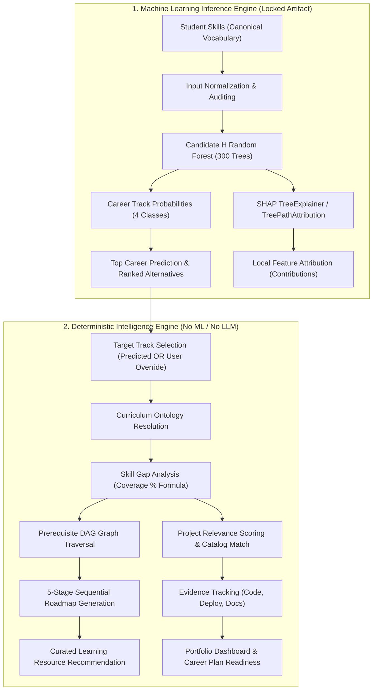

# CareerCompass AI — System Architecture & Data Pipeline

This document details the complete end-to-end architecture, inference pipeline, explainability framework, and deterministic progression engine of **CareerCompass AI**.

---

## 1. High-Level Architecture Overview

```
                  CAREERCOMPASS
                       │
        ┌──────────────┴──────────────┐
        │                             │
     FRONTEND                       BACKEND
        │                             │
 React + TS                     FastAPI
        │                             │
        └──────────────┬──────────────┘
                       │
                ML INFERENCE
                       │
                Candidate H RF
                       │
              Career Prediction
                       │
              ┌────────┴────────┐
              │                 │
           SHAP              Ontology
        Explanation              │
                                 ▼
                             Skill Gap
                                 │
                             Roadmap
                                 │
                             Learning
                                 │
                             Projects
                                 │
                             Portfolio
                                 │
                         Career Readiness
```

---

## 2. Core Separation of Concerns

A foundational design principle of CareerCompass is the strict architectural boundary between **Machine Learning Inference** and **Deterministic Educational Progression**:



> [!IMPORTANT]
> **Deterministic Guarantee**:
> The Skill Gap Analysis, 5-Stage Roadmap, Learning Resource Mappings, Project Recommendations, and Portfolio Evidence Coverage are **NOT** generated by an LLM or additional ML model. They are evaluated deterministically using verified curriculum rules, directed prerequisite graphs, and exact mathematical formulas. This enforces deterministic rule-based evaluation, ensures 100% reproducibility, and provides transparent auditability.

---

## 3. Data Flow & Sequential Pipeline

### Step 1: Input Normalization & Vocabulary Auditing
- Client submits arbitrary skill tokens (e.g. `["python", "machine learning", "unknown_skill"]`).
- Server normalizes casing, collapses whitespace/hyphens into underscores (`"machine_learning"`), strips non-alphanumeric punctuation, and deduplicates.
- Tokens are partitioned against the 29-feature canonical vocabulary into `recognized_skills` and `unknown_skills`.

### Step 2: ML Inference & Feature Attributions
- Model: Candidate H (`RandomForestClassifier`, 300 estimators, `class_weight=None`, `random_state=42`).
- Inference evaluates raw tree votes to output probabilities for all 4 canonical tracks:
  1. `Software Development & Engineering`
  2. `AI & Machine Learning Engineering`
  3. `Data Analytics & Business Intelligence`
  4. `Cloud, DevOps & Systems Engineering`
- Local explanation decomposes the top prediction using SHAP `TreeExplainer` (or deterministic `TreePathAttribution` fallback) to show positive/negative skill attributions (model-behavior explanations; strictly non-causal).

### Step 3: Human-in-the-Loop Target Resolution
- Student inspects model prediction and explanation.
- Student may accept the model prediction as their planning target, OR select a manual career override (e.g., target SDE despite AI/ML prediction).
- The system stores both independently in state:
  - `state.careerPrediction`: Preserves real ML output.
  - `state.selectedCareerTarget`: Stores user planning target.

### Step 4: Deterministic Skill Gap Analysis
- Evaluates the planning target against the curated curriculum ontology (curated product knowledge, not machine-learned):
  $$\text{Coverage (\%)} = \frac{|\text{Acquired Skills} \cap \text{Track Core Skills}|}{|\text{Track Core Skills}|} \times 100$$
- Identifies missing core competencies and missing secondary competencies.
- Checks prerequisite dependencies: competencies with unfulfilled prerequisites are marked `blocked`.

### Step 5: 5-Stage Sequential Roadmap
- Organizes required competencies into 5 structured stages:
  - Stage 1: Prerequisites & Tooling
  - Stage 2: Core Fundamentals
  - Stage 3: Applied Frameworks
  - Stage 4: Systems & Tooling
  - Stage 5: Capstone Synthesis
- Milestones dynamically unlock as earlier prerequisites are completed.

### Step 6: Project Intelligence & Proof-of-Work
- Ranks catalog projects based on a rule-based project relevance score addressing missing target skills:
  $$\text{Relevance Score} = \min\left(100, \; \frac{|\text{Missing Core}| \times 2.0 + |\text{Missing Secondary}| \times 1.0}{\max(1, |\text{Total Project Target Skills}|)} \times 100\right)$$
- Verifies deliverable evidence: GitHub repository link, live demo deployment, technical documentation.
- Completing projects records verifiable milestones and state-derived achievements.

### Step 7: Portfolio & Readiness Synchronization
- Calculates total Portfolio Evidence Coverage (portfolio evidence/coverage metric, not proof of professional competency):
  $$\text{Portfolio Coverage (\%)} = \frac{|\text{Competencies Backed by Completed Projects}|}{|\text{Track Skills}|} \times 100$$
- State is serialized and persisted immutably in `localStorage`.
